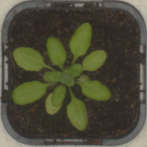

# UNet-based semantic segmentation

Model detects and masks leaves on plants images

### Example:
 


### Metrics:
[**Dice loss**](https://arxiv.org/abs/1707.03237): **0.0063** on test dataset

### Wrapper usage example:

```python
from plant_semantic import PlantsSemantic

model = PlantsSemantic('model.pth')
model.process('plant0551_rgb.png', 'plant0551_p.png')
```